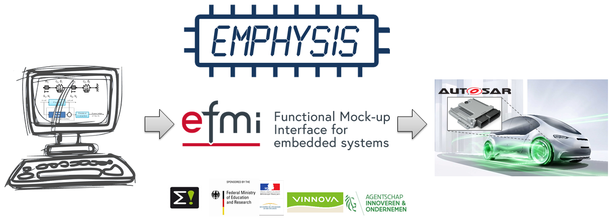

# EMPHYSIS website

This repository contains the sources of the [EMPHYSIS website](https://emphysis.github.io) and is the central location for feature requests, suggestions and bug reports.

## Contributing

See the [contribution guide](CONTRIBUTING.md) for documentation on how to [add a news post](CONTRIBUTING.md#adding-a-news-post) and [update the tools list](CONTRIBUTING.md#updating-the-tools-list)
